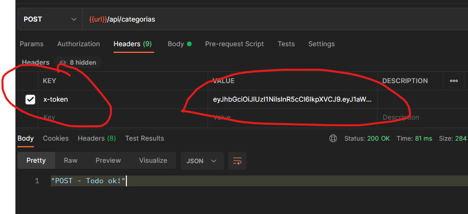
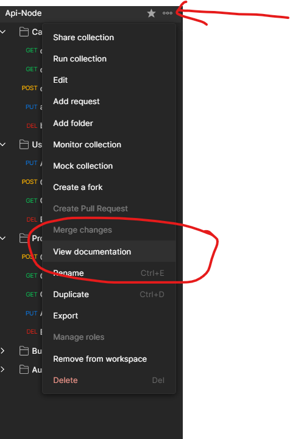
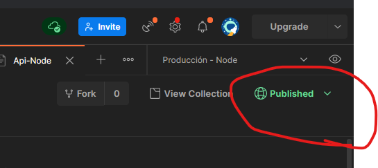

# Web Server + RestServer

#### App productiva - url: https://app-rest-node-app.herokuapp.com/

Ejecutar el comando ```npm install``` para reconstruir los modulos de node

- 1.- Inicializando servidor con express y configurando el puerto como una variable(dotenv)
- 2.- Configurando el servidor como una clase
- 3.- Creando las peticiones de un CRUD
- 4.- Instalación de CORS - facilitar o restringir la acomunicación entre apis
- 5.- Configurando el router
- 6.- Creando las funciones controlador
- 7.- Obtenindo datos del POST usando el req.body
- 8.- Obteniendo la info que llega como parametro o como query
- 9.- Creando cluster y usuario en mongoDB
- 10.- Configuración entre mongoDB cloud y mongo compass
- 11.- Configurando conexión a la base de datos
- 12.- Definiendo el Schema/modelo que se usara en la api
- 13.- Hacer persistente la información en la base de datos - método post
- 14.- Encriptando la contraseña con el paquete bcryptjs
- 15.- (express-validator) Validando registro previo de correo
- 16.- (express-validator) Validando registro de correo sea en formato correcto
- 17.- (express-validator) Validando correo, nombre y rol
- 18.- (express-validator) usando middleware para validar campos
- 19.- (express-validator - mongoose) Validando rol contra la base de datos
- 20.- Uso de carpeta helpers para centralizar la validación del rol
- 21.- Metodo toJSON usado en el módelo del objeto usuario para mostrar en la creación del objeto los campos que sólo se quieran mostrar
- 22.- Validando existencia de correo
- 23.- Implementación de handler put - actualizarUsuarios
- 24.- Validaciones adicionales en put
- 25.- (GET) Leyendo y mostrando todos los datos guardados
- 26.- (GET) Paginando y liminado el número de registros a mostrar
- 27.- (GET) Retornar número total de registros en una collección - uso de promise - async/await
- 28.- (DELETE) Integridad referencial. En este ejemplo, la referencia del documento en la base de datos se conserva, pero no se borra de la bd, solo se cambia de estado, así no se elimina completamente un registro pero se muestra como eliminado de los registros para los usuarios.
- 29.- Actualizando repo productivo en heroku
<hr/>

<div id="cambiando_variables_heroku"></div>
*** Modificando las variables de entorno configuradas en HEROKU ***

- 30 .- Cambiando las variables e entorno del proyecto en local a el repo de heroku
    - *** En este commit se cambió la variable de entorno MONGODB_CNN configurandola de manera productiva a heroku ***
    -
    - Crear variables de entorno:
        - Conocer las variables de entorno configuradas ```heroku config```
        - Agregar una variable de entorno ```heroku config:set NOMBRE_DE_VARIABLE="valor_de_variable"```
            - ejemplo: ```heroku config:set NOMBRE="César"```
        - Borrar una variable de entorno ```heroku config:unset nombre_variable_borrar```
    - Ejemplo de configurar cadena de conexión a heroku:
        -  heroku config:set MONGODB_CNN="mongodb+srv://<nombre_usuario>:<contraseña>@<nombreclusther><nombre_colección>"

### JWT - AUTHENTICACIÓN - TOKEN DE ACCESO

- 31.- Creación de la ruta que permite authenticar el login (controller - ruta - handler)
- 32.- Configurando la validación correo existente, usuario activo(borrado) y contraseña valida para generar el login
- 33.- (JWT) Utilizado la libreria jsonwebtoken para generar el token de autenticación y configurando el métedo que permite la autenticación en los helpers
- 34.- Se cambia visualmente _id por uid en la clase modelo del usuario que le indica a moongo como crear el documento
- 35- Uso de middleware para generar la validación del JWT, el cual va a permitir generar acciones sobre nuestras rutas/vistas
- 36.- Obteniendo información del usuario autenticado
- 37.- Configurando que al cambiar el estado de un registro a false se invalide el token generado y de esta manera evitar el login del egistro eliminado
- 38.- Validando que el usuario exista en la base de datos, en caso de no existir no permitir que el token sea valido
- 39.- Se crea un middleware que permite validar si el rol del usuario es ADMIN_ROLE -> para la prueba esto va  permitir que si se tiene el rol anteriormente mencionado este usuario ADMIN va a poder borrar(cambiar estado) de la base de datos
- 40 .- Se crea un middleware que permite validar los roles y con ello permitir accions en los diferents handlers, para el ejercicio es en el handler deleteUsuario
- 41.- Optimizando las importaciones e los middlewares -> checar que en las importaciones de los middlewares los
- nombres no chocan
- 42.- Estableciendo ```SECRETORPRIVATEKEY``` como variable de entorno en HEROKU ---> * [verpaso30](#cambiando_variables_heroku) para identificar los pasos a seguir
    - *** Ver logs de app productiva en heroku ```heroku logs -n 100 ``` ***
    - *** Ver logs de app productiva en heroku en tiempo real```heroku logs -n 100 --tail``` ***


###  Iniciar sesión en sitios web - Google Sing-In for Websites

- 43.- Generando ```API Key y API Secret de Google``` = GOOGLE_CLIENT_ID y GOOGLE_SECRET_ID de [GOOGLe sign-in for Websites](https://developers.google.com/identity/sign-in/web/backend-auth) - Para ello se debe de tener cuenta de google
- 44.- [Integrando el servicio ](https://developers.google.com/identity/sign-in/web/sign-in) - este URL mustra los pasos a seguir para utilizar la funcionalidad que google ofrece la cual va a permitir loguear con nuestra cuenta de google o salir de sesión
- 45.- [Pasos para autenticarse con un servidor backend](https://developers.google.com/identity/sign-in/web/backend-auth) - probando la ruta /api/auth/google para configurar la autenticación
- 46.- Mandando a llamar nuestro servicio de autenticación desde nuestro frontend usando fetch-api
- 47.- Validando Token de google en el backend
- 48.- Crear usuario personalizado con las credenciales de google
- 49.- Estableciendo ```GOOGLE_CLIENT_ID``` como variable de entorno en HEROKU ---> * [verpaso30](#cambiando_variables_heroku) para identificar los pasos a seguir

<hr/>

#### [Documentación generado con postman sobre nuestra api hasta el momento](https://documenter.getpostman.com/view/7410558/TzsWtq68)
<hr/>


### Sesión de app Categorias y productos
- 50 .- CRUD y rutas de Categorías
    - Creando las rutas
    - Editando el servidor
- 51 .- Modelo categoria
    - Creando el modelo de categoria
        - Se le da nombre, estado y se le RELACIONA con un objeto para su creación, que en este caso sera Usuario; si no existe un usuario creado o el usuario no cuenta con estado true en la base de datos, no se crea una categoría
    - Se crea un index.js en la carpeta models, el cual sirve para centralizar las importaciones de nuestros modelos
- 51.- Crear una categoria
    - Se crean una categoria con validaciones en el router
    - Se crea el método controlador el cual va a permitir antes de guardar la nueva categoria creada:
        - A través de res guardar el nombre asignado en mayusculas
        - Buscar usando un método de mongoose( Categoria.findOne({ nombre }) ) la existencia de la categoria
        - Verificar si la categoria creada ya existe, en caso de existir regresa una respuesta
        - Identificar la data a guardar y almacernarla como un objeto
        - Guadar la categoria en un nuevo objeto recibiendo como parametro la data
        - Guardar la categoria creada usando el método e mongoose save()
        - Regresar la respuesta em formato json junto con uel status http 201 de creado
        - 
- 52.- Se crea al método obtenerCategorias  - paginando los resultados - si,ilar al método getUsuarios
    - Se usa el metodo populate de mongoose para mostrar los datos del usuario que crea la categoria
    - Se modifica el método CategoriaSchema.methods.toJSON para evitar enviar datos a la vista
- 53.- Obtener categoria por id
    - Se crea el controlador
    - Se valida que el id de la categoria exista (db-validators)
    - Se creal altuta y se añaden los check validando un id de mongo valido y que exista la categoria validando su id
- 54.- Actualizar Categoria
    - Se crea el método actualizarCategoria en el controlador:
        -  eliminado de la req.body estado y usuario para que estos datos no sean editados y los datos restndtes guardandolos en un nuevo objeto llamado data
        - Se utiliza el método Categoria.findByIdAndUpdate para actualizar la información
    - En el router se valida:
        - Quien modifique la información tenga un token valido
        - Que se envie el nombre como obligatorio
        - que el id exista
        - que se validen los campos
- 55.- Se elimina una categoria(cambia e estado e true a false)
    - Para cambiar el estado se hace uso de la función de mongoose findByIdAndUpdate en el controllador
    - En el router se valida qu quien elimine tenga un token valido, cuente con rol de admin,  qu cuente el id con un id valido de mongo, que exista el id de la categoria y que se validen los campos
- 56.- Definiendo el path de productos en el servidor (models/server.js)
- 57.- Creando el modelo de productos y definiendo su exportación en models/index.js
- 58.- Se crean las rutas y los controladores de Producto


  ### Busquedas tomando en cuenta las colecciones
  <br>
- 59.- Ruta para realizar busquedas
    - Se crea el router que va a permitir realizar busquedas de un producto tomado en cuenta su categoria
    - Se crea el controlador el cual va recibir como parametros categoria y producto
    - Se configura el servidor para que tome la ruta de la busquedas
- 60.- Busqueda en base de datos - validar que usuario sea buscado con un Id válido de mongo
- 61.- Busqueda en base de datos - validar que usuario sea buscado por correo o nombre
    - Se usan operadores lógicos de mongo ($and - $or)
    - Ayudado de expresión regular la búsqueda se genera por correo o nombre trayendo todas las coincidencias
    - Se ha validado para que sólo se muestre los usuarios activos
    - Se muestran el conteo de los resultados de las busquedas
- 62.- Busqueda en base de datos de categorias - productos
    - Se crean los métodos que permiten buscar categorias o productos por su mongoID o por su nombre

<hr/>

#### [URl de nuestra app hasta el momento en producción](https://app-rest-node-app.herokuapp.com/)  --> https://app-rest-node-app.herokuapp.com/

<hr/>


<hr/>

### Ver la documentación de la api desde postman

<p align="center">
  
   
</p>

<hr/>

 ### Carga de Archivos

 - 63.- Ruta para realizar carga de archivos
    - Se crea el router que va a permitir cargar un archivo
    - Se crea el controlador
    - Se configura el servidor para que tome la ruta de la carga de archivos
- 64.- Subiendo archivos
    - Se instala la librería express-fileupload
    - Se agrega al archivo server.js el middleware de fileupload
    - En el archivo del controlador uploads.js:
        - Se valida que se este cargando un archivo archivo
        - Si existe un archivo, se le da una ruta al archivo para designar donde va a ser guardado
        - *** Se debe de asegurar la existencia de la carpeta donde se van a resguardar los archivos ***
        - Ejemplo de configuracón: https://github.com/richardgirges/express-fileupload/blob/master/example/server.js
- 65 .- Validar la extensión del archivo cargado
    - Se corta el nombre del archivo creando un arreglo, esto sirve para identificar la extensión del archivo cargado
    - Se crea un arreglo con las extensiones validas para poder comparar y aceptar que el archivo cuente con una extensión válida
- 66 .- Ubicar y cambiar nombre de archivo que se envia
    - Usando al librería UUID se le asigna un nombre a las imagenes, lo cúal permite identicar de manera única cada una de ellas
- 67 .- Helper -> Subir archivo
    - Se crean un index de los helpers en la carpeta helpes para hacer más practicar la importación
    - Se crea una función helper en el archivo helpers/subir-archivo.js, el cúal contiene la lógica que permite subir el archivo. Esta lógica previamente ya estaba creada dentro el archivo controllador/uploads.js, pero ahora al separa la funcionalidad, la lógica de  helpers/subir-archivo.js puede ser utilizada en otra parte de nustra aplicación.
    - En el archivo controllador/uploads.js se ha agregado la función vargar archivo de helpers/subir-archivo.js y su funcionalidad ahora tambíen se le agregado que sea un método asincrono
- 68 .- Crear carpetas destino de los archivos creados
    - En el archivo helpers/subir-archivo.js se creo anteriormente la función crearArchivo, el cúal recibe 3 argumentos por defecto: files, extensionesValidas = ['png', 'jpg', 'jpeg', 'gif'], carpeta = ''.
    - Para el ejemplo actual, en el archivo controllers/uploads.js se han cambiados los parametros por defecto, aceptando sólo archivos 'md' o 'txt' y resguardandolos en una carpeta llamada textos. Para que lo anterior sea posible, se configura en el server él middleware que permite cargar archivos ( --> this.app.use(fileupload({ ) para que el argumento createParentPath: este en true
- 69 .- Carpeta destino de imagenes
    - Se cambiaron parametros para que se cree la carpeta que guarde las imagenes y que valide extenciones para guardar imagenes
    - Se maneja con try-catch la funcionalidad de guardar imagenes para mejorar el manejo de errores
- 70.- Ruta para actualizar imagenes de Usuarios y Productos
    - Se crea en el router la petición put con sus validaciones para actualizar la imagenes
    - Se crea la función coleccionesPermitidas en el archivo helpers/db-validators.js para validar que en la busqueda se esta buscando una coleccion permitida, esta función es usada en el router
    - Se crea el controlador que ayuda a identificar los parametros a recibir en la petición de la actualización de la imagen
